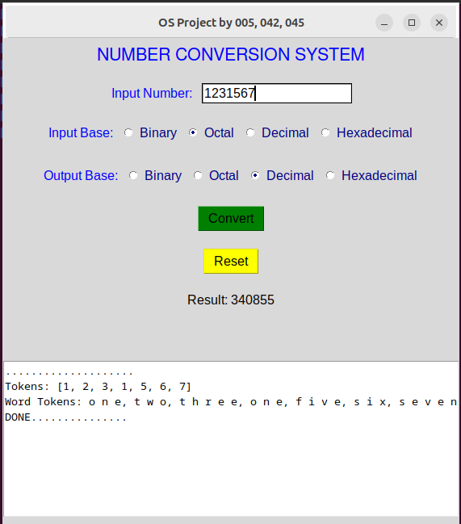
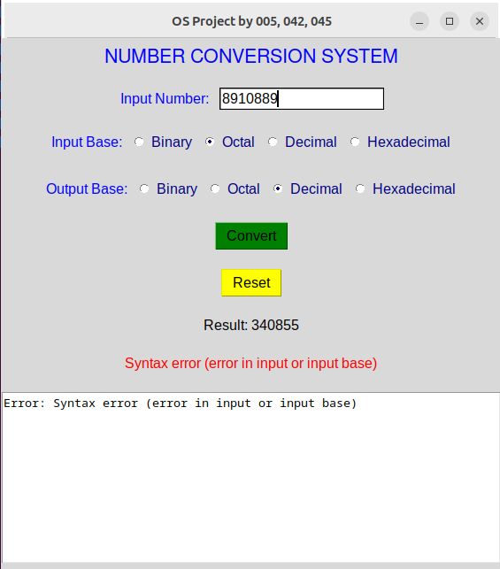
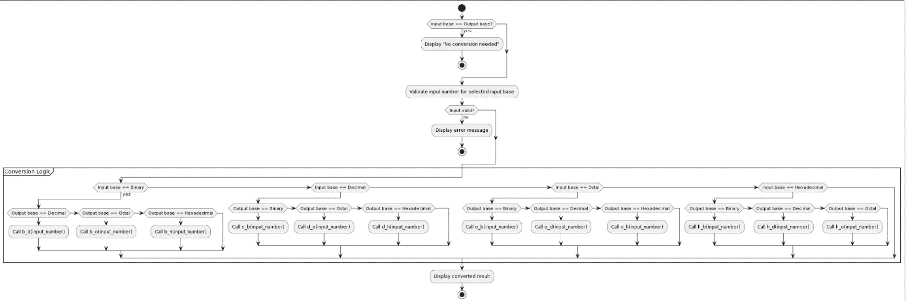

# 🔢 Number Conversion System with Lexical Tokenizer

<div align="center">


A dynamic, desktop-based **Number Conversion & Tokenizer System** developed using **Python** and **Tkinter GUI** for Linux/Ubuntu environments. Built as a laboratory project to demonstrate OS system utilities and basic interpreter architecture, this system supports conversion across four primary base systems (Binary, Octal, Decimal, Hexadecimal) and features a lexical tokenizer that breaks inputs into individual digit/character tokens and converts them to words.

</div>

---

## 📸 Application Screenshots

<table>
  <tr>
    <td align="center"><br/><b>🟢 Successful Conversion & Tokenization Tracing</b></td>
    <td align="center"><br/><b>🔴 Base Syntax Error Validation & Handling</b></td>
  </tr>
  <tr>
    <td align="center" colspan="2"><br/><b>🗺️ System Conversion Logic Flowchart</b></td>
  </tr>
</table>

---

## ✨ System Features

- **🎛️ Interactive GUI**: A graphical desktop application built with Python's standard `tkinter` framework, styled for clean usability.
- **🔢 Four-Base Cross-Conversion**: Convert numbers between:
  - **Binary** (Base 2)
  - **Octal** (Base 8)
  - **Decimal** (Base 10)
  - **Hexadecimal** (Base 16)
- **🧠 Lexical Digit Tokenizer**: Tokenizes the input string into individual digits/characters and converts them into spoken English words (e.g., `123` becomes `one, two, three`) using the `inflect` module, mimicking the lexical parsing phase of compiler design.
- **🛡️ Live Syntax Validation**: Actively verifies whether the input characters are valid for the selected input base (e.g., rejecting letters in decimal, digits `8-9` in octal, or non-binary digits in binary).
- **📝 Execution Logging**: Real-time terminal output integrated inside a bottom text widget, tracing tokens, word equivalents, error stacks, and execution lifecycle state.

---

## ⚙️ System Conversion Logic

The underlying logic maps combinations of input and output bases using individual mathematical routines:

| Base | Binary (`2`) | Octal (`8`) | Decimal (`10`) | Hexadecimal (`16`) |
|---|---|---|---|---|
| **Binary** | Identical | `b_o()` | `b_d()` | `b_h()` |
| **Octal** | `o_b()` | Identical | `o_d()` | `o_h()` |
| **Decimal** | `d_b()` | `d_o()` | Identical | `d_h()` |
| **Hexadecimal** | `h_b()` | `h_o()` | `h_d()` | Identical |

---

## 🏗️ Technical Architecture & Algorithms

### Step-by-Step Execution Lifecycle
1. **User Input Selection**: The user enters a string in the input field, clicks radio buttons for the source base and the target base, then clicks **Convert**.
2. **Input Validation**: The app verifies the string characters against the allowed character set of the source base.
3. **Lexical Analysis (Tokenization)**:
   - Breaks the input string into a list of characters.
   - Maps each character to its decimal value (for Hex, e.g., `A` becomes `10`).
   - Translates values into English words using `inflect.engine()`.
4. **Base Conversion**: Converts the number to the target base using standard Python parsing primitives (e.g., `bin()`, `oct()`, `hex()`, and base-parametered `int()`).
5. **Output Update**: Renders the converted value in the result field and logs process metadata to the internal tracing box.

---

## 📂 Project Structure

```
CONVERSION-OF-NUMBER-SYSTEM/
│
├── 🐍 OSproject.py                   — Main Tkinter GUI application code
├── 📁 screenshots/
│   ├── bu_logo.jpg                   — Bahria University Logo
│   ├── success_screen.png            — Application in success state
│   ├── error_screen.png              — Base validation error state
│   └── conversion_flowchart.png      — Diagram of the conversion logic flow
├── 📄 README.md                      — Project documentation
└── 📦 OS Project Report + Project.zip — Full archive with code and DOCX report
```

---

## 🚀 Getting Started

### Prerequisites

- **Python 3.x**
- **Tkinter** (usually comes with Python on Windows/macOS; on Linux, run `sudo apt-get install python3-tk`)
- **Inflect package** (`pip install inflect`)

### Run the App

1. Clone this repository:
   ```bash
   git clone https://github.com/AnasQ2003/CONVERSION-OF-NUMBER-SYSTEM.git
   cd CONVERSION-OF-NUMBER-SYSTEM
   ```
2. Install dependencies:
   ```bash
   pip install inflect
   ```
3. Execute the Python script:
   ```bash
   python OSproject.py
   ```

---

## 📚 Course Context

| Detail | Info |
|---|---|
| **University** | Bahria University, Karachi Campus |
| **Department** | Department of Computer Science |
| **Course** | Operating Systems Lab (CSL-320) |
| **Semester** | 5th Semester |
| **Class** | BSCS 5A |
| **Teacher** | Ma'am Mehwish Saleem |
| **Group Members** | Abdul Samad, Anas Ahmed Qureshi, M. Ahmed Usmani |

---

## 📄 License

```
MIT License

Copyright (c) Conversion of Number System---2026 AnasQ2003

Permission is hereby granted, free of charge, to any person obtaining a copy
of this software and associated documentation files (the "Software"), to deal
in the Software without restriction, including without limitation the rights
to use, copy, modify, merge, publish, distribute, sublicense, and/or sell
copies of the Software, and to permit persons to whom the Software is
furnished to do so, subject to the following conditions:

The above copyright notice and this permission notice shall be included in all
copies or substantial portions of the Software.

THE SOFTWARE IS PROVIDED "AS IS", WITHOUT WARRANTY OF ANY KIND, EXPRESS OR
IMPLIED, INCLUDING BUT NOT LIMITED TO THE WARRANTIES OF MERCHANTABILITY,
FITNESS FOR A PARTICULAR PURPOSE AND NONINFRINGEMENT.
```

---

## 👨‍💻 Author

**Anas Ahmed Qureshi.** — [@AnasQ2003](https://github.com/AnasQ2003)

---

<div align="center">
  <p>Built with ❤️ by <strong>Anas</strong></p>
  
 <div align="center">

Made with 🔥 and a lot of ☕

**⭐ If you found this useful, please star the repository!**

</div>

